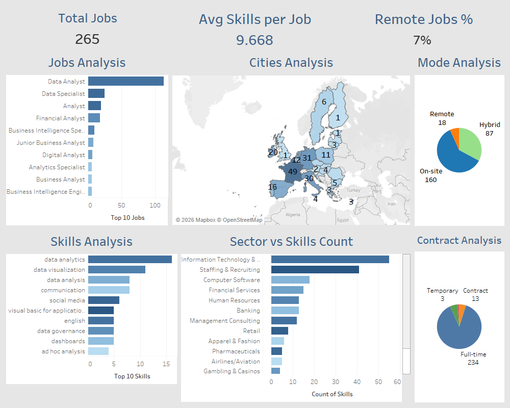

# HR Case Study - Job Market & Recruitment Analysis

## 📌 Project Overview
This project analyzes HR data focusing on job postings, recruitment trends, and labor market insights. The goal is to identify patterns in job types, locations, and required skills to help stakeholders make data-driven hiring decisions.

## 📊 Dataset
The dataset includes information from LinkedIn job postings, such as:
- **Job Titles & Sectors**
- **Contract Types** (Full-time, On-site, etc.)
- **Geographic Data** (City, Country)
- **Required Skills**

## 🛠️ Tools Used
- **Excel/Python**: For data cleaning and initial exploration.
- **Tableau**: For creating interactive dashboards and visualizing KPIs.
- **GitHub**: For documentation and version control.

## 📈 Key Insights & Dashboard

## 🔍 Analysis & Key Insights
This analysis includes:
- Data cleaning and preprocessing  
- Exploratory Data Analysis (EDA)  
- Visual insights about supplier performance, cost, and quality  

### 💡 Key Insights  
- Supplier 4 has approximately **15–20% higher cost** compared to other suppliers  
- Supplier 3 shows a **defect rate of ~18%**, higher than the overall average (~12%)  
- Skincare products contribute to around **35–40% of total cost**, making them the most expensive category  
- Cosmetics category demonstrates approximately **10–15% better cost efficiency** compared to other product types
- Supplier 4 contributes to approximately **30–35% of total supply volume**
  
## 📄 Notebook & Case Study
- **Notebook**: [Open Notebook](notebook/HR_case_Study_.ipynb)  
- **Case Study PDF**: [View Case Study](Case_Study.pdf/Manufacturing_Case_Study.pdf)
## Tableau Workbooks

All Tableau workbooks are stored in the `Tableau_work_book` folder:

- [Dashboard Workbook](Tableau_work_book/hrcasestudy.twb)

The notebook contains step-by-step analysis including data loading, cleaning, feature summarization, and visualization. The PDF provides a complete report for stakeholders.

## 🎯 Recommendations
- Optimize supplier selection  
- Implement cost reduction strategies  
- Improve quality control for certain suppliers

  
## 💼 Business Impact

This analysis can help businesses to:

- Reduce operational costs by identifying high-cost suppliers  
- Improve supplier selection based on performance and quality  
- Enhance product quality by addressing high defect rates  
- Optimize product strategy based on cost distribution across categories  

## 🙍‍♂️ Author
**Ahmed Wagdy**  
Data Analyst | HR Analysis

